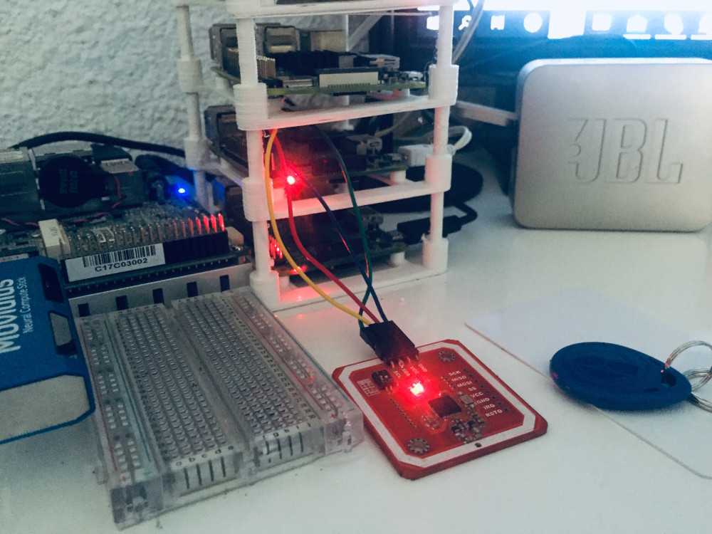
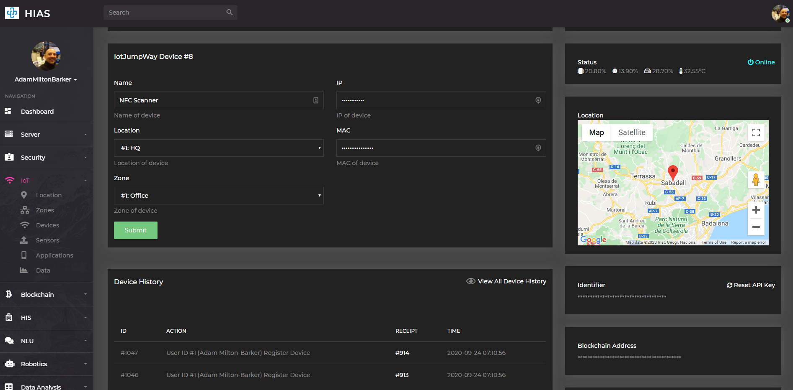
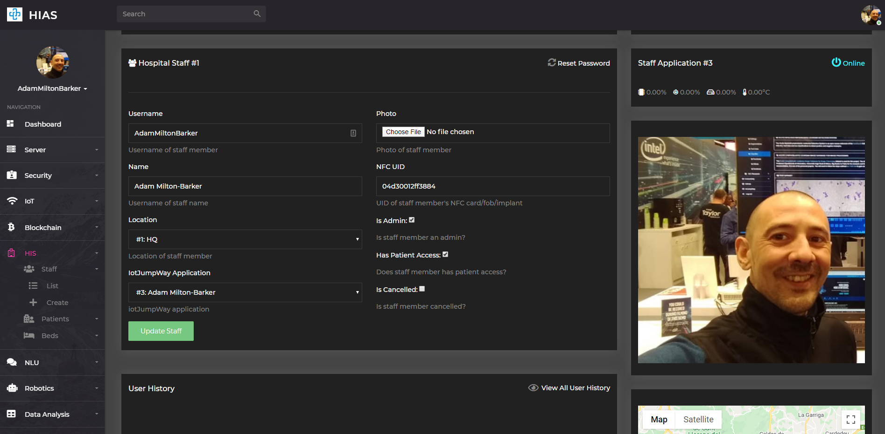

# Asociacion De Investigacion En Inteligencia Artificial Para La Leucemia Peter Moss
## HIAS NFC Authorization System

[](https://github.com/LeukemiaAiResearch/HIAS-NFC)

[](https://github.com/LeukemiaAiResearch/HIAS-NFC/tree/0.0.0) [](https://github.com/LeukemiaAiResearch/HIAS-NFC/tree/0.1.0) [](CONTRIBUTING.md)  [](issues) [](LICENSE)


&nbsp;

# Table Of Contents

- [Introduction](#introduction)
- [Prerequisites](#prerequisites)
  - [HIAS Server](#hias-server)
- [System Requirements](#system-requirements)
- [Hardware Requirements](#hardware-requirements)
- [Setup](#setup)
  - [UFW Firewall](#ufw-firewall)
  - [Clone the repository](#clone-the-repository)
      - [Developer Forks](#developer-forks)
  - [Install Dependencies](#install-dependencies)
  - [Raspberry Pi Setup]($raspberry-pi-setup)
  - [PN532 Setup](#pn532-setup)
  - [iotJumpWay](#iotJumpWay)
    - [Configuration](#configuration)
  - [Staff Account](#staff-account)
- [Start The System](#start-the-system)
- [HIAS UI](#hias-ui)
- [Contributing](#contributing)
    - [Contributors](#contributors)
- [Versioning](#versioning)
- [License](#license)
- [Bugs/Issues](#bugs-issues)

&nbsp;

# Introduction
The HIAS NFC Authorization System is an IoT connected NFC reader that can scan NFC implants, cards and fobs to identify users on the HIAS network. The current functionality sends the recieved UID to the HIAS iotJumpWay broker and where it is first verified that it belongs to an authorized user, stored in the database and a hash saved on the HIAS Blockchain for data integrity. The HIAS iotJumpWay service

The project runs on a **Raspberry Pi 2b** and above.

&nbsp;

# Prerequisites
Before you can install this project there are some prerequisites.

## HIAS Server
Follow the [HIAS Installation Guide](https://github.com/LeukemiaAiResearch/HIAS/blob/master/Documentation/Installation/Installation.md) to complete your HIAS server setup.

&nbsp;

# System Requirements
- [Raspian Buster (Raspberry Pi OS)](https://www.raspberrypi.org/downloads/raspberry-pi-os/)
- [Python 3.6](https://www.python.org/ "Python 3.6")
- Requires PIP3

# Hardware Requirements
- 1 x [PN532 NFC Reader/Writer](https://dangerousthings.com/product/pn532/ "PN532 NFC Reader/Writer")
- 1 x [Raspberry Pi 2B Or Above](https://www.raspberrypi.org/products/raspberry-pi-2-model-b/)

&nbsp;

# Setup
Now you will setup the HIAS NFC Authorization System. The following tutorial will take you through the setup steps.

## UFW Firewall
UFW firewall is used to protect the ports of your device. Use the following command to check the status of your firewall:

```
  sudo ufw status
```
You should see the output:
```
  Status: inactive
```

To allow access for SSH use the following commands:

```
  sudo ufw allow 22
  audo ufw enable
  sudo ufw status
```

You should see the following output:

```
  Status: active

  To                         Action      From
  --                         ------      ----
  22                         ALLOW       Anywhere
  22 (v6)                    ALLOW       Anywhere (v6)
```

## Clone the repository
Clone the [HIAS NFC](https://github.com/LeukemiaAiResearch/HIAS-NFC "HIAS NFC") repository from the [Asociacion De Investigacion En Inteligencia Artificial Para La Leucemia Peter Moss](https://github.com/LeukemiaAiResearch "Asociacion De Investigacion En Inteligencia Artificial Para La Leucemia Peter Moss") Github Organization.

To clone the repository and install the UP2 NCS1 USB Camera Security System, make sure you have Git installed. Now navigate to the home directory on your device using terminal/commandline, and then use the following command.

```
  git clone https://github.com/LeukemiaAiResearch/HIAS-NFC.git
```

Once you have used the command above you will see a directory called **HIAS-NFC** in your home directory.

```
  ls
```

Using the ls command in your home directory should show you the following.

```
  HIAS-NFC
```

Navigate to the **HIAS-NFC** directory, this is your project root directory for this tutorial.

### Developer Forks
Developers from the Github community that would like to contribute to the development of this project should first create a fork, and clone that repository. For detailed information please view the [CONTRIBUTING](CONTRIBUTING.md "CONTRIBUTING") guide. You should pull the latest code from the development branch.

```
  git clone -b "0.1.0" https://github.com/LeukemiaAiResearch/HIAS-NFC.git
```

The **-b "0.1.0"** parameter ensures you get the code from the latest master branch. Before using the below command please check our latest master branch in the button at the top of the project README.

## Install Dependencies
Now you will install the required dependencies. [Setup.sh](Setup.sh "Setup.sh")is an executable shell script that will do the following:

- Install the required Python packages

To execute the script, make enter the following commands. This will take a long time!

```
  sed -i 's/\r//' Setup.sh
  sh Setup.sh
```

## Raspberry Pi Setup
First you need to set up your Raspberry Pi to able to use I2C. The following instructions are based on the Raspberry Pi B2, for later versions the instructions may vary.

Open raspi-config using the following command:

```
 sudo raspi-config
```
Then go to **Interfacing Options** and enable **I2C**. Next you will need to check that **dtparam=i2c_arm=on** is uncommented in **/boot/config.txt**.

## PN532 Setup
Now you need to connect your **PN532** to your Raspberry Pi. To do so, use the following map:

- PN532 GND > RPI Pin 6
- PN532 VCC > RPI Pin 4
- PN532 SDA > RPI Pin 3
- PN532 SCL > RPI Pin 5

## iotJumpWay


You need to setup your iotJumpWay device that will be used to communicate with the HIAS iotJumpWay broker. In the HIAS UI, navigate to **IoT->Devices** and click on the **+** button to be taken to the device create page.

- For **Name** add a custom name for your device
- For **Location** and **Zone** select the iotJumpWay location and zone, if you have not set these up yet you can do this in the **IoT->Zones** section.
- For **IP** add the IP address of your RPI device.
- For **Mac** add the MAC address of your RPI device.

In addition to creating your iotJumpWay credentials, the HIAS system will create a HIAS Blockchain user and provide the required blockchain persmissions for the RPI to communicate with the databases and store hashes in the HIAS Blockchain iotJumpWay Data Integrity Smart Contract.

### Configuration

Once you have created your device you will be taken to the new device page. Add your server name and the information provided on that page to your  configuration. Use that configuration to update your config in the [Required/config.json](Required/config.json) file.

```
{
    "iotJumpWay": {
        "host": "",
        "port": 8883,
        "ip": "",
        "ipinfo": "",
        "lid": 0,
        "zid": 0,
        "did": 0,
        "dn": "",
        "un": "",
        "pw": ""
    }
}
```
## Staff Account

Finally you need to add the UID of your card/fob or implant to your user account. In the HIAS UI, navigate to **Hospital->Staff->List** click on the **Edit** link for the relevant staff account, and update the **NFC UID** field with the UID of your chip.

# Start The System
Now that everything is installed and configured, you can start the system. Use the following command to start the HIAS NFC Authorization System:

```
 python3 NFC.py
```
You should see the following:
```
2020-09-24 23:17:50,915 - NFC - INFO - Helpers class initialization complete.
2020-09-24 23:17:50,920 - iotJumpWay - INFO - Helpers class initialization complete.
2020-09-24 23:17:50,923 - iotJumpWay - INFO - Initiating Local iotJumpWay Device.
2020-09-24 23:17:50,924 - iotJumpWay - INFO - iotJumpWay Device Device Initiated.
2020-09-24 23:17:50,926 - iotJumpWay - INFO - Initiating Local iotJumpWay Device Connection.
2020-09-24 23:17:51,228 - iotJumpWay - INFO - Local iotJumpWay Device Connection Initiated.
2020-09-24 23:17:51,231 - iotJumpWay - INFO - -- Subscribed to Device Commands Channel
2020-09-24 23:17:51,242 - iotJumpWay - INFO - Local iotJumpWay Device Connection Successful.
2020-09-24 23:17:51,243 - iotJumpWay - INFO - rc: 0
2020-09-24 23:17:51,244 - iotJumpWay - INFO - Published to Device Status 1/Devices/1/8/Status
2020-09-24 23:17:51,246 - iotJumpWay - INFO - -- Published to Device channel
2020-09-24 23:17:51,251 - iotJumpWay - INFO - iotJumpWay Device Subscription: 1
2020-09-24 23:17:51,296 - NFC - INFO - Found board PN5 0x32 Firmware ver. 1.6
2020-09-24 23:17:51,307 - NFC - INFO - Waiting for NFC chip...
2020-09-24 23:17:51,309 - NFC - INFO - NFC Class initialization complete.
2020-09-24 23:17:51,331 - NFC - INFO - GeniSysAI Life (TEMPERATURE): 32.552°
2020-09-24 23:17:51,332 - NFC - INFO - GeniSysAI Life (CPU): 20.8%
2020-09-24 23:17:51,334 - NFC - INFO - GeniSysAI Life (Memory): 13.9%
2020-09-24 23:17:51,335 - NFC - INFO - GeniSysAI Life (HDD): 28.7%
2020-09-24 23:17:51,339 - iotJumpWay - INFO - -- Published to Device channel
```
If you now run an NFC chip over the scanner, you should see the following:
```
2020-09-24 23:19:50,612 - NFC - INFO - Found an NFC chip!
2020-09-24 23:19:50,613 - NFC - INFO - Chip UID: 04d30012ff3884
2020-09-24 23:19:50,617 - NFC - INFO - Waiting for NFC chip...
2020-09-24 23:19:50,619 - iotJumpWay - INFO - -- Published to Device channel
2020-09-24 23:19:50,621 - iotJumpWay - INFO - -- Published to Device channel
2020-09-24 23:19:51,711 - iotJumpWay - INFO - iotJumpWay Device Message Received
2020-09-24 23:19:51,713 - NFC - INFO - Recieved iotJumpWay Command Data : {"From": "4", "Type": "NFC", "Value": "Authorized", "Message": "NFC Chip Authorized"}
```
Her the UID from the chip has been sent to the HIAS iotJumpWay service, which has verified it belongs to a member of staff, stored a hash of the interaction on the HIAS Blochain, and sent a command back to the device informing it that the chip is authorized.

# HIAS UI

All data that passes through the HIAS iotJumpWay Broker is stored in the local Mongo Database and also a hash is stored in the HIAS Blockchain iotJumpWay Smart Contract. This means that we can verify if data has been tampered with.

Head to **IoT->Data** and scroll down to the Sensors & Commands data, you can click on the verify button to compare the hash of the data in the database with the hash stored on the blockchain, if all good, the data will pass the data integrity checl.

&nbsp;

# Contributing
Asociacion De Investigacion En Inteligencia Artificial Para La Leucemia Peter Moss encourages and welcomes code contributions, bug fixes and enhancements from the Github community.

Please read the [CONTRIBUTING](CONTRIBUTING.md "CONTRIBUTING") document for a full guide to forking our repositories and submitting your pull requests. You will also find information about our code of conduct on this page.

## Contributors

- [Adam Milton-Barker](https://www.leukemiaresearchassociation.ai/team/adam-milton-barker "Adam Milton-Barker") - [Asociacion De Investigacion En Inteligencia Artificial Para La Leucemia Peter Moss](https://www.leukemiaresearchassociation.ai "Asociacion De Investigacion En Inteligencia Artificial Para La Leucemia Peter Moss") President & Lead Developer, Sabadell, Spain

&nbsp;

# Versioning

We use SemVer for versioning. For the versions available, see [Releases](releases "Releases").

&nbsp;

# License

This project is licensed under the **MIT License** - see the [LICENSE](LICENSE "LICENSE") file for details.

&nbsp;

# Bugs/Issues

We use the [repo issues](issues "repo issues") to track bugs and general requests related to using this project.